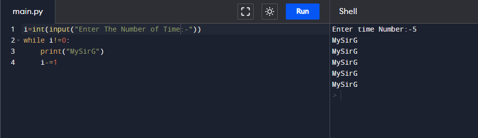
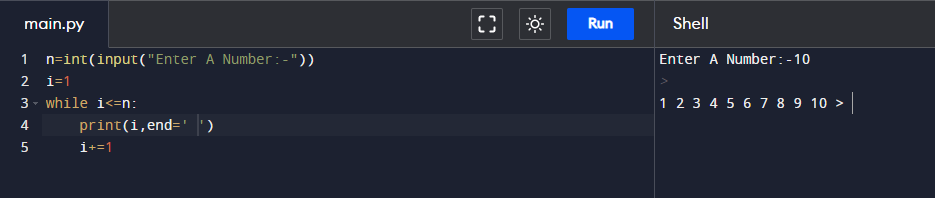
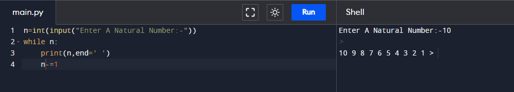
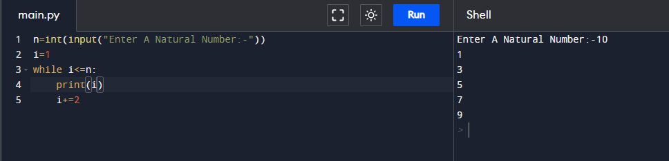
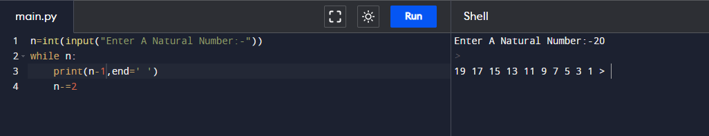
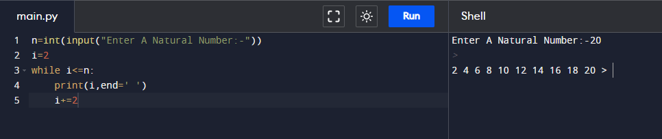
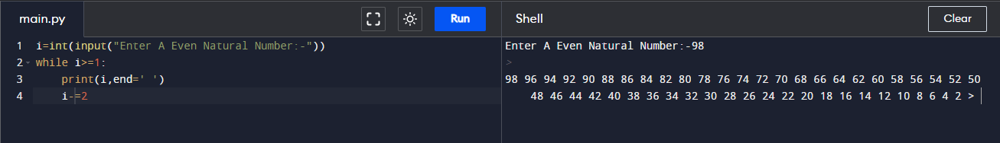
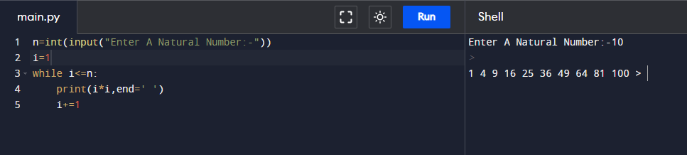
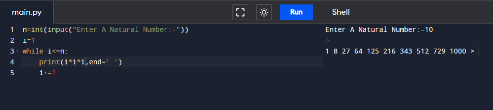
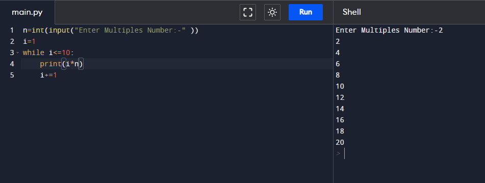

# Assignment - 9 Full Stack Web Development using Python MySirG While Loop

    Qns 1. Write a python script to print MySirG N times on the screen.

    Ans.

    Qns 2. Write a python script to print first N natural numbers.

    Ans.

    Qns 3. Write a python script to print first N natural numbers in reverse order.

    Ans.

    Qns 4. Write a python script to print first N odd natural numbers.

    Ans.

    Qns 5. Write a python script to print first N odd natural numbers in reverse order.

    Ans.

    Qns 6. Write a python script to print first N even natural numbers.

    Ans.

    Qns 7. Write a python script to print first N even natural numbers in reverse order.

    Ans.

    Qns 8. Write a python script to print squares of first N natural numbers.

    Ans.

    Qns 9. Write a python script to print cubes of first N natural numbers.

    Ans.

    Qns 10. Write a python script to print first 10 multiples of N.

    Ans.
